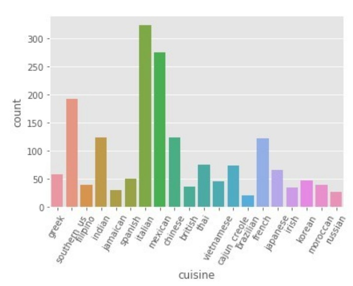

# Naive Bayes Classifier based on Cooking Dataset
 

It is the implementation of project in ALGORITHMS:DESIGN AND ANALYSIS course  \
Department: Computer Science,Athens University of Economics and Business
 
 # Project Informations and Description 
 
 **_Input of the Project:_**
Dataset with 1794 recipes.Each recipe have three columns id , cuisine regionality and its
ingredients

**_Purpose of the Project:_**
Implementation of Naive Bayes on the above dataset , predicting cuisine type from recipe
ingredients

 ***Naive Bayes***
 
 Bayes’ Theorem finds the probability of an event occurring given the probability of another event
that has already occurred.Putting a naive assumption to the Bayes’ theorem,we have independence
among the features(here each ingredient is independent).Regarding to our dataset ,we can apply
Naive Bayes in following way:   P(y|x1,...xn) = P(x1|y)...P(xn|y) / P(x1)P(x2)..P(xn)
where X = { ingredient1 , ingredient2 , .... , ingredient n}
and y = cuisine type

As the denominator remains constant for a given input, we can remove that term:
P(y|x1,...xn) = P(y)Π P(xi|y)

So ,in our example :

P(cuisine | ingredients) = P(cuisine) P(ingredient_1 | cuisine)p(ingredient_2 |
cuisine)...P(ingredient_n | cuisine)

## Files 
* training.json(data used for training)
* NaiveBayes.py(implementation of naive bayes on the above dataset)
* Cooking.pdf(Project)    

# Results 
 - accuracy of Naive Bayes 
   - 0.58
 - accuracy of Naive Bayes with 6-Cross Validation
   - 0.55
 - accuracy when predicting a cuisine by chance 
   - 0.05 
 - accuracy when always answering the most likely cuisine
   - 0.18
   
   The accuracy has an acceptable value but not so high and this is because Naive Bayes does not
 always work so good because naive bayes classifier makes a very strong assumption on the shape
 of data distribution plus the fact of having a difficult dataset .Furthermore , I have to mention that
 the accuracy predicting a cuisine by chance was ~ 0.05 and the accuracy if we always answer the
 most likely cuisine(e.g “Italian”) the accuracy was also ~0.18, so our accuracy value of 0.58 is a
 good number.
 
 # Training Time and Memory Usage 
 
   * Training time was 3.9460670948028564 seconds
   * Memory usage was 0.595148 MB
   * Peak was 3.107731 MB
   * The project was done in Colab uisng GPU as hardware accelerator.

 
